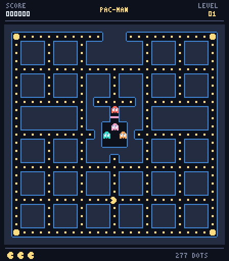
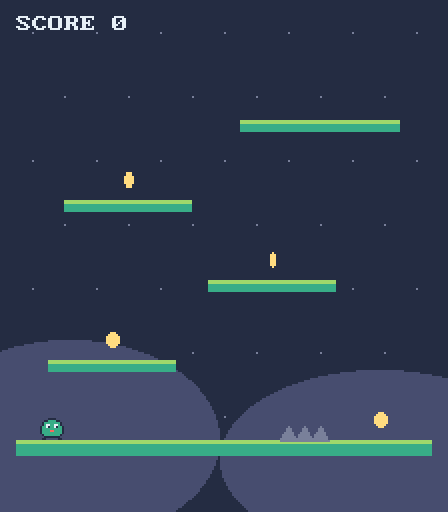
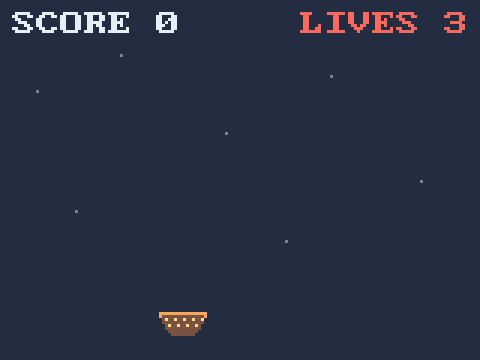
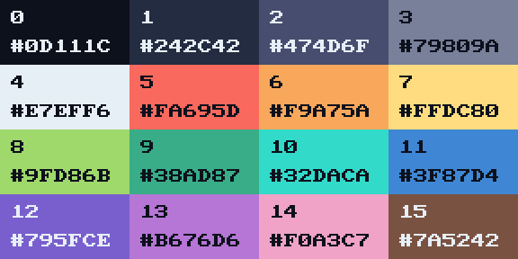
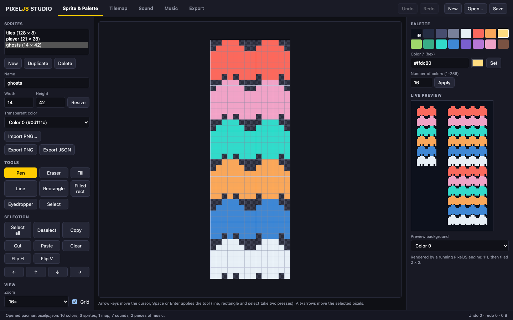
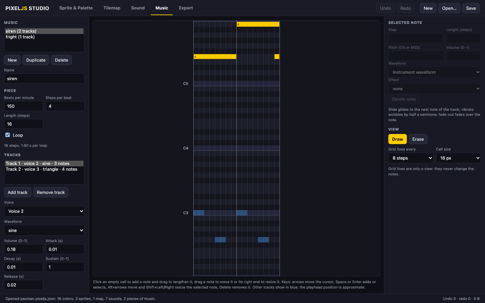

<p align="center">
  
</p>

<h1 align="center">PixelJS</h1>

<p align="center">
  A retro game engine for JavaScript and TypeScript, with a C core compiled to WebAssembly.
</p>

<p align="center">
  <a href="https://www.npmjs.com/package/@pixeljs/core"></a>
  <a href="https://github.com/alexandroit/pixeljs/actions/workflows/ci.yml"></a>
  <a href="LICENSE"></a>
</p>

**PixelJS** is a small engine for making pixel-art games that run in the browser. You write your game in JavaScript or TypeScript; drawing, sound synthesis and the validation of everything you pass in happen in C, compiled to WebAssembly.

Its rules come from the fantasy consoles: an indexed framebuffer, a fixed palette of 16 colors by default, four sound channels, bitmap fonts and integer-only drawing, so a game looks and sounds the same in every browser. PixelJS brings that way of making games to the web platform and to npm.

<p align="center">
  
  
</p>

Play the demo at **[pixeljs.com](https://pixeljs.com)**, then make your own game with `npm create @pixeljs@latest`.

## Specifications

- Runs in modern browsers (tested in Chromium, Firefox and WebKit) and on Android inside a Capacitor shell
- Games in JavaScript or TypeScript, as ES modules, with complete type declarations
- Screen of 1 to 1024 pixels per side (256 × 144 by default), displayed with crisp whole-pixel scaling
- Palette of 1 to 256 colors, 16 by default
- Up to 256 images, tilemaps and bitmap fonts per engine
- 4 sound channels with square, triangle, sine and noise waves, envelopes, and slide, vibrato and fade-out effects
- Music of up to 4 tracks, sequenced to the sample on the audio clock
- Keyboard, mouse, touch (up to 10 contacts), wheel and gamepad input
- PNG screenshots and GIF recordings of the game
- PixelJS Studio, a browser editor for sprites, palettes, tilemaps, sounds and music
- WebGL2 rendering with a Canvas2D fallback; about 66 KiB of compressed JavaScript and WebAssembly before the first frame; no runtime dependencies

### Color Palette



## How to Install

PixelJS runs in the browser, so there is nothing to install on the player's machine. To develop a game you need [Node.js](https://nodejs.org) 20.19 or later.

### Create a new game

```sh
npm create @pixeljs@latest my-game
cd my-game
npm install
npm run dev
```

The starter is a small platformer in strict TypeScript, built with [Vite](https://vite.dev). Add `-- --template javascript` after the project name for plain JavaScript.

### Add PixelJS to an existing project

```sh
npm install @pixeljs/core
```

The package contains ES modules, type declarations, both WebAssembly binaries and the audio worklet. It has no dependencies and no install scripts, and you never need a C compiler.

### Try the examples

| Example                                                               | What it shows                                                                                                      |
| --------------------------------------------------------------------- | ------------------------------------------------------------------------------------------------------------------ |
| [Pac-Man](https://pixeljs.com) ([source](examples/javascript))        | Tilemaps, sprite sheets, bitmap fonts, sounds and music loaded from one asset manifest, touch and gamepad controls |
| The starter platformer (`npm create @pixeljs@latest`)                 | Sprites, shapes, text, synthesized sounds and music, keyboard and gamepad input                                    |
| [Star Catcher](docs/tutorial.md)                                      | The game you build in the tutorial, step by step                                                                   |
| [PixelJS Studio](https://pixeljs.com/editor/) ([source](apps/editor)) | The editor, itself built on PixelJS for its live previews                                                          |

## How to Use

### Create an engine

Create an engine on a canvas, then give it an `update` and a `draw` function:

```js
import { createEngine } from '@pixeljs/core';

const engine = await createEngine({
  canvas: document.querySelector('canvas'),
  width: 160,
  height: 120,
});

let x = 80;

engine.start({
  update(dt) {
    if (engine.input.isDown('ArrowLeft')) x -= 60 * dt;
    if (engine.input.isDown('ArrowRight')) x += 60 * dt;
  },
  draw() {
    const g = engine.graphics;
    g.clear(1);
    g.circleFill(Math.round(x), 60, 8, 7);
    g.text(4, 4, 'HELLO, PIXELJS', 4);
  },
});
```

`update` runs at a fixed 60 times per second, whatever the display's refresh rate, so game logic is deterministic. `draw` runs once per displayed frame and queues drawing commands; when it returns, the whole frame is validated and drawn in C. If any command is invalid, nothing of that frame is drawn and an error explains which command failed.

Colors are palette indices and coordinates are whole pixels: round positions you move with fractional speeds. The canvas is shown at the size your CSS gives it, or pass `scaling: 'integer'` and PixelJS picks the largest whole multiple that fits the canvas's parent.

### Draw with images, maps and text

Images are grids of palette indices. Create them from code, or load PNG files, whose colors are mapped to the nearest palette color:

```js
const hero = await engine.loadImage('hero.png', { transparentIndex: 0 });

// Inside draw():
g.sprite(hero, x, y, { flipX: facingLeft });
g.sprite(hero, x, y, { rotation: 90, scale: 2 }); // degrees, about the center
```

Tilemaps draw a grid of tiles cut from an image, and fonts are 1-bit bitmaps in any size up to 64 × 64 pixels. A single asset manifest can list every file a game needs; it loads them all, or none of them if one fails:

```json
{
  "format": "pixeljs-assets",
  "version": 1,
  "images": {
    "tiles": { "src": "tiles.png" },
    "hero": { "src": "hero.png", "transparentIndex": 0 }
  },
  "tilemaps": { "level1": { "src": "level1.json", "tileset": "tiles" } },
  "fonts": { "hud": { "src": "hud-font.json" } },
  "sounds": { "jump": { "src": "jump.json" } },
  "music": { "theme": { "src": "theme.json" } }
}
```

```js
const assets = await engine.loadAssets('assets/assets.json');
const level1 = assets.tilemap('level1');
```

### Play sound and music

Every sound is synthesized by a four-channel synthesizer written in C, so there are no audio files to decode. A sound is a single note or a short jingle; music has up to four tracks:

```js
const jump = engine.audio.createSound({
  waveform: 'square',
  frequency: 220,
  effect: 'slide',
  slideTo: 660,
  duration: 0.12,
});
const theme = engine.audio.createMusic({
  bpm: 120,
  length: 16,
  tracks: [
    {
      waveform: 'triangle',
      notes: [
        { step: 0, pitch: 'C4', length: 4 },
        { step: 8, pitch: 'G3', length: 4 },
      ],
    },
  ],
});

// Browsers only start audio from a user gesture, such as the first key press.
addEventListener('keydown', () => engine.audio.unlock().catch(() => {}), { once: true });
engine.audio.playMusic(theme); // Starts as soon as audio is running.
engine.audio.play(jump);
```

The synthesizer runs in its own WebAssembly instance inside an AudioWorklet, off the main thread. Music steps are timed to the sample on the audio clock, so a busy frame never delays a note.

### Create resources with PixelJS Studio

[PixelJS Studio](https://pixeljs.com/editor/) is a browser editor for everything a game uses: sprites and palettes, tilemaps, sound effects and four-track music on a piano roll. It saves projects as JSON and exports the files an asset manifest loads, together with the manifest itself.

<p align="center">
  
  
</p>

### Capture screenshots and GIFs

```js
const png = await engine.capture({ scale: 4 }); // a Blob
engine.startRecording({ maxSeconds: 8, scale: 2 });
// …
const gif = await engine.stopRecording(); // a looping GIF Blob
```

The animations in this README were recorded that way.

### Publish your game

`npm run build` in a starter project writes static files to `dist/`. Upload them to any static host. Serve `.wasm` files as `application/wasm` and use HTTPS, which browsers require for the audio worklet. If your site sends a Content-Security-Policy, `script-src 'self' 'wasm-unsafe-eval'` is all PixelJS needs: it never uses `eval`, inline scripts or remote code.

## API Reference

This is a summary. The [API reference](docs/api.md) documents every option, error and limit, and the [tutorial](docs/tutorial.md) builds a complete game.

### Engine

- `createEngine({ canvas, width?, height?, updateHz?, palette?, scaling?, renderer?, onError? })`: Load the engine and create a framebuffer on `canvas`. Resolves to an engine
- `engine.start({ update, draw })`: Start the game loop. `update(dt)` runs `updateHz` times per second (60 by default); `draw()` runs once per displayed frame
- `engine.pause()`, `engine.resume()`: Pause and resume the loop. The engine also pauses by itself while the page is hidden
- `engine.dispose()`: Stop the engine and release everything it holds
- `engine.width`, `engine.height`, `engine.state`: The screen size and the lifecycle state
- `engine.resize(width, height)`: Change the screen size between frames
- `engine.setPalette(colors)`: Replace every palette color between frames
- `engine.readPixel(x, y)`: The palette index of a pixel of the last frame
- `engine.getStats()`: Frame and update counts, memory used by the C core and the active renderer

### Graphics

Available inside `draw()` as `engine.graphics`.

- `clear(col)`: Fill the screen with color `col`
- `pixel(x, y, col)`: Draw a pixel
- `line(x1, y1, x2, y2, col)`: Draw a line
- `rect(x, y, w, h, col)`, `rectb(x, y, w, h, col)`: Draw a rectangle, filled or as an outline
- `circle(x, y, r, col)`, `circleFill(x, y, r, col)`: Draw a circle of radius `r`, as an outline or filled
- `ellipse(x, y, w, h, col)`, `ellipseFill(x, y, w, h, col)`: Draw the ellipse inscribed in a rectangle
- `triangle(x1, y1, x2, y2, x3, y3, col)`, `triangleFill(x1, y1, x2, y2, x3, y3, col)`: Draw a triangle
- `fill(x, y, col)`: Flood-fill the area around (`x`, `y`) that has the same color
- `sprite(image, x, y, { sourceX, sourceY, width, height, flipX, flipY, rotation, scale })`: Draw an image, or a rectangle of it, flipped, rotated (degrees) or scaled
- `tilemap(map, x, y, { startCol, startRow, cols, rows })`: Draw a tilemap, or a window of it
- `text(x, y, s, col, { font, background })`: Draw a string with the built-in 8 × 8 font or a custom font
- `remap(from, to)`, `resetRemap()`: Draw color `from` as color `to` until the end of the frame
- `setCamera(x, y)`: Offset the drawing that follows
- `setClip(x, y, w, h)`, `resetClip()`: Limit the drawing that follows to a rectangle
- `setPaletteColor(index, r, g, b)`: Change one palette color, together with this frame

### Resources

- `createImage({ width, height, pixels, transparentIndex? })`: Create an image from palette indices
- `createTilemap({ cols, rows, tileWidth, tileHeight, tileset, tiles })`: Create a tilemap from tile IDs
- `createFont({ glyphWidth, glyphHeight, firstChar?, charCount?, bitmap })`: Create a bitmap font
- `loadImage(src)`, `loadTilemap(src, { tileset })`, `loadFont(src)`, `loadJson(src)`: Load one file
- `loadAssets(manifest)`: Load every file of an asset manifest into a bundle
- `measureText(s, font?)`: The width and height `text()` would draw
- `release(resource)`: Free an image, tilemap, font, sound or piece of music

### Input

Read in `update()` as `engine.input`. Every tick sees a stable snapshot, so a press is never missed or seen twice.

- `isDown(key)`, `wasPressed(key)`, `wasReleased(key)`: The state of a key, by `KeyboardEvent.code` (`'ArrowLeft'`, `'KeyZ'`, `'Space'`, …)
- `pointer`, `pointers`: The primary pointer and every mouse, pen or touch contact, in game pixels
- `wheel`: The mouse wheel movement since the previous tick
- `isButtonDown(button, pad?)`, `wasButtonPressed(...)`, `wasButtonReleased(...)`: Gamepad buttons (`'A'`, `'B'`, `'Start'`, `'Left'`, …)
- `axis(name, pad?)`: A gamepad stick axis (`'leftX'`, `'leftY'`, `'rightX'`, `'rightY'`) from -1 to 1

### Audio

Available as `engine.audio`.

- `unlock()`: Start audio. Call it from a user gesture
- `play(sound, voice?)`, `stop(instance?)`: Play a sound on one of the 4 channels; stop one sound or everything
- `createSound(options)`, `loadSound(src)`: Define a single-note sound or a jingle of up to 64 notes
- `createMusic(options)`, `loadMusic(src)`: Define music of up to 4 tracks of 512 notes
- `playMusic(music, { loop? })`, `stopMusic()`, `musicPlaying`: Play and stop music
- `setVolume(volume)`: Set the output volume, from 0 to 1

### Capture

- `capture({ scale? })`: A PNG of the last displayed frame
- `startRecording({ maxSeconds?, scale? })`, `stopRecording()`, `recording`: Record a looping GIF of the frames in between

Errors are `PixelJSError` objects with a `code` such as `RANGE`, `STATE`, `CAPACITY` or `ASSET_LOAD`; see the [API reference](docs/api.md#errors).

## How It Works

Each engine owns a WebAssembly instance of the C core, with its own memory. During `draw()`, the SDK encodes your drawing calls into compact 32-byte commands. When `draw()` returns, the core validates the whole frame first (every argument, every resource handle and a budget on the total work) and only then draws it into an indexed framebuffer, using integer arithmetic only. The renderer uploads the framebuffer as an 8-bit texture and a WebGL2 shader turns indices into colors through the palette; without WebGL2, a Canvas2D path produces identical pixels. Audio runs in a second, independent WebAssembly instance inside an AudioWorklet.

The [architecture guide](docs/architecture.md) covers the command protocol, resource ownership, the audio transport, memory limits and the security model.

## How to Contribute

Bug reports and feature requests are welcome in [GitHub Issues](https://github.com/alexandroit/pixeljs/issues). To report a security problem, please follow the [security policy](SECURITY.md) instead.

To build PixelJS from source and run its tests (the C core natively and under sanitizers, the WebAssembly build, and browser tests in Chromium, Firefox and WebKit), see [CONTRIBUTING.md](CONTRIBUTING.md).

## Other Information

- [Tutorial](docs/tutorial.md): your first game, step by step
- [API reference](docs/api.md): every function, option and limit
- [Architecture](docs/architecture.md): how the engine is built
- [Changelog](CHANGELOG.md)

## License

PixelJS is released under the [MIT License](LICENSE). The art, fonts, sounds and music of the examples were made for this project and are covered by the same license.

Pac-Man is a trademark of Bandai Namco Entertainment Inc.; the demo on pixeljs.com is an unofficial tribute whose code, maze, graphics, sounds and music are original.
